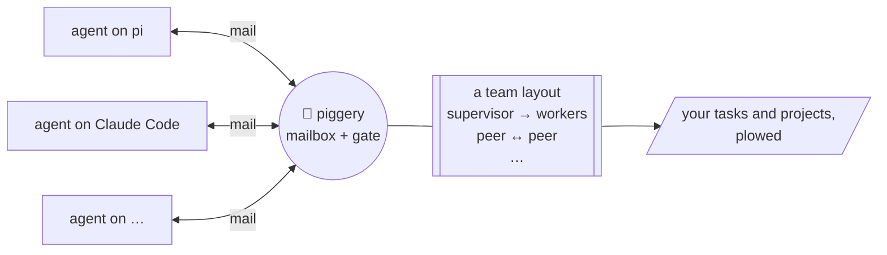

# Piggery 🐖 - Lợn cày tasks

This is the local development fork at [haohao3k/piggery](https://github.com/haohao3k/piggery),
derived from [sting8k/piggery](https://github.com/sting8k/piggery). Development pushes go to this
fork. Read [AGENTS.md](AGENTS.md) and the [local workflow](docs/local-development.md) before changing it.

Your coding agents are pigs. Piggery is the farm.

Work goes into a pig's trough and waits there until the pig is back. It only counts as eaten
when the job is actually done, not when the pig sniffed at it. Every pig also has a pen: its
role says who it may talk to and whether it may have piglets (workers). The farm checks the
fence itself, so no amount of sweet talk gets a pig through it.

pi, Claude Code, Codex, omp and dsh pigs all live on the same farm and talk to each other. The
farm is one Go binary and a SQLite file, and nothing runs in the cloud.


## How it works



Every agent gets the same mailbox, whatever its harness: a pi session can mail a Claude Code
session, and a worker's answer wakes whoever is waiting for it. Each mail and each spawn passes
the gate, which checks it against the team's layout: a small YAML file you pick or write. A few
come built in as examples (`supervisor-executor`, `slp`, `council`, `triple-review`, `p2p`); any other shape is
another file.

## Harnesses

| Harness | Your sessions | Workers piggery starts | Tested with | Add piggery |
|---|---|---|---|---|
| [pi](https://github.com/earendil-works/pi) | yes (extension) | yes (`pi --mode rpc`) | 0.87.1 | `piggery setup pi` |
| [Claude Code](https://claude.com/product/claude-code) | yes (plugin + MCP) | yes (`claude -p`) | 2.1.283 | `piggery setup claude` |
| [Codex](https://github.com/openai/codex) | yes (hooks + MCP) | yes (`codex app-server`) | 0.157.1 | `piggery setup codex` |
| [omp](https://github.com/can1357/oh-my-pi) | yes (extension) | yes (`omp --mode rpc`) | 18.4.2 | `piggery setup omp` |
| [dsh](https://github.com/deepseek-ai/deepseek-harness) | yes (`dsh web`, plugin) | yes (`dsh --profile sdk`) | 0.2.0-rc.1 | `piggery setup dsh` |

A role's workers run on the harness its template names (`spawn.harness`), else on the one of the
session that founded the team. `piggery setup` alone shows each harness's version and whether
piggery is installed in it.

## Install

```sh
git clone https://github.com/haohao3k/piggery.git
cd piggery
git switch codex/local-development
./install.sh
piggery setup pi       # and/or: claude, codex, omp, dsh
```

The installer builds this checkout, stamps its source identity, checks whether activation is safe,
installs it in `~/.local/bin`, refreshes installed integration assets, and restarts the existing
Piggery home. Go 1.26+ and Python 3 are required. Busy agents block activation; an idle worker is
stopped by the normal graceful restart and keeps its recorded session for a later authorized resume.
See the local workflow for the invoking-session exception and readback requirements.

Using [Paseo](https://paseo.sh)? `piggery setup paseo` adds a Piggery view (the same as
`piggery top`) to the app. Turn on plugins in Paseo's settings once.

After installation, `piggery update` rebuilds and activates the owning local checkout's source and
assets; `piggery update --check` verifies source, installation and daemon without changing them.
`--force` cannot bypass the idle gate or download a release. Bootstrap or repair with
`scripts/local-dev.sh apply`; do not install `sting8k/...@latest` over this fork.
The Go module keeps its upstream import path for compatibility; `go build ./cmd/piggery` uses the
local checkout's source and embedded assets. Changes are in [CHANGELOG.md](CHANGELOG.md).

## Quick start

1. Open pi, Claude Code, Codex, omp or `dsh web` in your project.
2. Ask it for a team: *"make a supervisor-executor team to fix the failing tests"*.
3. Watch the farm: `piggery top`.

More: [docs/guide.md](docs/guide.md) covers running teams, watching and stepping in, and customizing
`~/.piggery` (config, templates, worker profiles, your own rules); [docs/reference.md](docs/reference.md)
lists every command, config key, profile key and manifest key.

## Farm layouts

| Template | Who does what |
| --- | --- |
| `supervisor-executor` | A supervisor splits the goal into checkable tasks; executors do them. |
| `slp` | You steer a supervisor; each lane has a lead and peers, often in its own git worktree. |
| `council` | A chair asks members for independent views on one hard decision. |
| `triple-review` | Two independent semantic reviewers and an OCR coverage reviewer inspect one frozen candidate; a coordinator adjudicates the evidence. |
| `p2p` | Peers that talk freely and spawn more peers. |

Make your own: `piggery template new mine --from slp`, then edit
`~/.piggery/templates/mine/manifest.yaml` (see the [guide](docs/guide.md#customize-piggery-piggery)).

For three-arm review, see [the review setup](docs/guide.md#three-arm-review): it needs two different
provider families and [open-code-review](https://github.com/alibaba/open-code-review) on the coverage worker's PATH.

## Build from source

```sh
go test ./...
./scripts/local-dev.sh build
./scripts/local-dev.sh apply
./scripts/local-dev.sh check
```

## License

MIT
